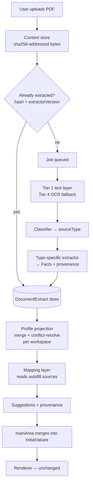

# Extraction Engine — Architecture Design

**Status:** Proposal for review. No code. No changes to the approved schema, renderer, or app shell.

**Author's stance:** This document recommends *one* architecture and argues for it. Where
credible alternatives exist they are named and explicitly rejected with reasons, so the
rejection can be revisited later on the evidence rather than re-litigated from scratch.

---

## 1. Scope

Design the subsystem that turns uploaded PDFs into pre-filled form fields:

```
Upload → Extraction Engine → Structured Patent Data → Auto-fill Renderer
```

Constraints carried in from approved decisions:

- Extraction is a **supporting subsystem, not the product**. The product is preparing forms.
- **Forms are never generated directly from PDFs.** Documents become structured data; forms
  consume the structured data.
- **The software suggests, the user decides.** No extracted value is ever locked.
- The renderer, form-definition schema, and app shell are approved and must not be redesigned.

---

## 2. What the repository already determines

The design is constrained by four things that already exist and are approved. Three of them
answer questions we would otherwise have to invent answers to.

### 2.1 The autofill contract is already a vocabulary

Every form definition already declares, per field, where its value could come from:

```json
"autofill": {
  "strategy": "direct",
  "sources": [
    { "sourceType": "form1",               "key": "applicant.name" },
    { "sourceType": "form2_specification", "key": "applicant.name" },
    { "sourceType": "patent_certificate",  "key": "applicant.name" }
  ],
  "confidence": "high"
}
```

Two consequences, both load-bearing:

1. **`sourceType` is the document classification target.** The classifier's output vocabulary is
   not a free design choice — it is exactly the set of `sourceType` values the definitions cite.
2. **`sources` is an ordered preference list.** The definition author already expressed *"prefer
   Form 1's applicant name, fall back to the specification, then the certificate."* Resolution
   order is authored data, not engine policy.

Across the two existing definitions: 11 distinct keys, 8 distinct sourceTypes. Across all 35
forms the union will plausibly land at 60–100 keys. **That union is the entire schema of the
structured data.** It is demand-driven — derived from what forms actually need — not from a
model of "everything about a patent."

### 2.2 The document specifications are an extraction knowledge base

`docs/specifications/form_01.md` … `form_31.md` transcribe every printed label of every official
form, verbatim, in printed order, including table columns and footnotes. For fixed-layout
government forms, printed labels are exactly what anchor-based extraction keys off. This asset
already exists and should be exploited rather than re-derived.

### 2.3 The backend scaffold names the pipeline stages

`extractor/` (pdf_reader → classifier → profile_builder), `extractors/` (per-document-type),
`models/patent_profile.py`, `services/extraction_service.py`. All unimplemented. The design below
fills these in rather than replacing them, with one structural amendment argued in §4.1.

### 2.4 Three defects found while reading

| # | Finding | Why it matters |
|---|---|---|
| **F1** | `form_03.definition.json` cites `sourceType: "form16"` — absent from the schema's recommended list and inconsistent with the `form26_authorisation` naming convention. | A typo'd key fails **silently**: no error, the field simply never auto-fills. This is the vocabulary-drift risk the schema README predicted, now real, in the only production definition. |
| **F2** | `patentee.details` (Form 27) is a composite blob — "name, address, nationality" — while `applicant.name` is atomic. | Composite keys can't be conflict-resolved, validated, or reused. The vocabulary needs an atomicity rule before 33 more definitions bake in the inconsistency. |
| **F3** | `mainArea.js`: `initialValues = saved ? saved.values : {}`. Nothing distinguishes user-entered from suggested values. | Once a draft is saved, suggestions become indistinguishable from user input — permanently. Re-extraction can never safely refresh them, and "the user decides" becomes unverifiable. Must be solved *before* the first suggestion is ever shown. |

F1 and F2 are cheap to fix now and expensive later (33 unwritten definitions). F3 is a
prerequisite for shipping any auto-fill at all.

---

## 3. Recommended architecture (one-line summary)

> **A demand-driven, deterministic-first extraction pipeline that produces immutable
> per-document Facts with provenance, projected on demand into a merged, conflict-resolved
> Profile, consumed by a generic mapping layer that contains no per-form logic.**

Five decisions carry the design. Each is argued below.

---

## 4. The five load-bearing decisions

### 4.1 Split the Profile into two levels — per-document and merged

**The problem.** The current `PatentProfile` model has a single `source: SourceDocument` — it is
shaped per-document. But auto-fill needs the opposite: Form 3's applicant name may come from
Form 1 *or* the specification *or* the certificate, whichever the user happened to upload. A
single-document model cannot answer a cross-document question.

**Recommendation — two distinct types:**

| Type | Cardinality | Role |
|---|---|---|
| **DocumentExtract** | one per uploaded PDF | Immutable record of what *this one file* yielded: classification, page count, and a list of Facts. Never merged, never edited. |
| **PatentProfile** | one per workspace | A **projection**: all DocumentExtracts merged and conflict-resolved. What auto-fill reads. |

The frozen principle — "every uploaded document must be converted into structured data, forms
never read PDFs" — is preserved exactly. This splits *where* that structure lives, so the
merge step has somewhere to exist.

> **Deviation flag.** This is the one place the design departs from the literal shape of the
> existing scaffold (`PatentProfile` currently holds one `source`). The scaffold is
> unimplemented placeholders, so nothing is being unbuilt — but it is a real change to a file
> that exists, and it needs explicit approval rather than being slipped in.

### 4.2 The unit of extraction is a Fact, not a value

A bare `key → value` map is insufficient. Every extracted value must carry its origin:

```
Fact {
  key              "application.number"      ← profile vocabulary key
  value            "201811000123"
  documentId       "doc_a1b2"                ← which upload
  documentType     "form1"                   ← equals the autofill `sourceType`
  page             1
  boundingBox      [x, y, w, h] | null       ← for "show me where this came from"
  confidence       0.0–1.0
  method           "anchor" | "regex" | "ocr" | "llm" | "manual"
  extractorVersion "form1@3"
  extractedAt      ISO-8601
}
```

**Why provenance is mandatory, not a nice-to-have:**

- **It is what makes "suggests, not decides" real.** A suggestion the user cannot interrogate is
  indistinguishable from an assertion. A patent attorney signs these forms and is professionally
  accountable for their contents; "the software filled it in" is not a defence. They must be
  able to ask *where did this come from* and get a document and a page.
- **Conflict resolution is impossible without it** (§4.3).
- **`extractorVersion` enables re-extraction.** When an extractor improves, re-run over stored
  bytes; no re-upload, and you can tell which Facts are stale.
- **Debugging.** "Why is this field wrong?" is answerable in one lookup.

`method` matters for user-facing honesty: an anchor-matched value from a government form and an
LLM's reading of prose deserve visibly different treatment.

### 4.3 Keep every candidate; resolve, never overwrite

The product premise is *"the user uploads whatever documents they already have"* — so
disagreement between documents is the normal case, not an error. An assignment means Form 1's
applicant and the certificate's patentee are *both correct*, at different times.

The merged Profile is therefore:

```
key → [Fact, Fact, …]   ordered by resolution policy, winner first
```

**Resolution policy**, in order:

1. **Definition-authored preference.** The order of `autofill.sources[]` in the *target field*.
   This is per-field, authored, and beats any global rule.
2. **Document authority.** A patent certificate outranks a draft specification for `patent.number`.
3. **Recency**, by document date where extractable, else upload time.
4. **Confidence**, as a final tiebreak.

Rule 1 is the important one: precedence lives in the form definitions, where a domain expert
already expressed it, not hard-coded in the engine.

Losing candidates are retained and surfaced ("2 other documents suggest a different value").
Silently discarding a conflicting value from a document the user deliberately uploaded is a
correctness failure, not a UX detail.

### 4.4 Deterministic-first; LLM strictly for unstructured prose

**This is the most opinionated call in the document, and the one I'd defend hardest.**

**Recommendation:** a tiered pipeline where LLMs are a narrow, opt-in, clearly-marked
last resort — never the foundation.

```
Tier 1  Text layer         pypdf / pdfplumber            fast path, most e-filed PDFs
Tier 2  Classification     anchor phrases → sourceType   "FORM 3", "STATEMENT AND UNDERTAKING…"
Tier 3  Anchor extraction  labelled-field lookup         the workhorse for IPO forms
Tier 4  OCR fallback       tesseract, when no text layer scanned/photocopied documents
Tier 5  LLM assist         unstructured prose only       opt-in, low confidence, marked
```

**Why deterministic wins for this specific domain:**

- **The documents are fixed-layout statutory forms.** Form 3's structure is set by the Patents
  Rules, 2003. It has not changed in ~20 years. Anchor extraction against a label that is fixed
  by law is not fragile — it is *more* stable than a model endpoint.
- **We already have the anchors.** §2.2: 35 specs transcribing every label verbatim. The hard
  part of deterministic extraction — knowing what to look for — is done.
- **Confidentiality is a professional obligation, not a preference.** Patent attorneys handle
  unpublished applications where disclosure can jeopardise novelty. Transmitting a client's
  unfiled specification to a third-party API is a decision that must be *explicit and opt-in*,
  never the default path. This alone disqualifies LLM-by-default.
- **Auditability.** "Matched the label 'Application No.' on page 1" is explainable to a client
  and reproducible in a test. "The model said so" is neither.
- **Offline.** It is a desktop application. Deterministic extraction works on a plane.
- **Cost and determinism at scale**, and no silent behaviour change when a model is deprecated.
- **The 5–10 year test.** Regex against a statutory form outlives any model generation.

**Where LLMs genuinely earn their place:** free prose where no anchor exists — the invention
title and abstract inside a specification body, summarising FER objections. Structure these as
a *pluggable strategy* behind the same Fact interface, so they are additive and removable.

**Rejected:** LLM-first ("just send the PDF and ask for JSON"). It is faster to prototype and
worse at everything that matters here — auditability, confidentiality, offline use, cost,
stability, and testability. Reaching for it first would be optimising the demo at the expense of
the product.

### 4.5 The mapping layer is generic — no per-form code, ever

The step from Profile → form field values must have the same property the renderer has: it reads
the definition and contains no knowledge of any specific form.

```
resolve(field, profile):
    for source in field.autofill.sources:            # authored preference order
        fact = profile.lookup(source.key, documentType=source.sourceType)
        if fact: return Suggestion(fact)
    return None
```

That is the whole algorithm. It works for Form 13 the day its definition is written, with zero
mapping code — the identical property that made the renderer succeed. Anything that would
require a `if formId == "form_13"` branch belongs in the definition instead.

**Array keys** (`foreignApplications[].country`) map to repeatable table rows: the profile
returns an ordered list of Fact-groups, one per row, which the existing table rendering already
consumes.

**Derived strategies** (6 of 22 refs) carry natural-language rules — *"Choose 'I' for a single
applicant, 'We' for multiple."* These are not machine-executable. **Recommendation: leave them
unfilled in v1.** Do not build a rules DSL for six fields; that is a language design project
justified by nothing. If, after real use, derived fields prove to be the main friction, add an
optional machine-readable `derivation.rule` in schema v1.1 — a targeted change with evidence
behind it.

---

## 5. Data flow



The renderer sits at the end of the chain and learns nothing new: it already accepts
`initialValues` and never locks them.

---

## 6. Storage

| Store | Location | Contents | Lifetime |
|---|---|---|---|
| **Content** | `backend/uploads/<sha256>.pdf` | Original bytes, content-addressed | Source of truth |
| **Extract** | `backend/data/extracts/<documentId>.json` | One DocumentExtract (Facts + provenance) | Derived — rebuildable from content |
| **Profile** | in-memory / cached projection | Merged view per workspace | Derived — rebuildable from extracts |

**Content-addressing** gives idempotent re-upload, deduplication, and re-extraction without
re-upload, for free.

**The Profile is a cache, never a database.** Delete it → rebuild from extracts. Delete extracts
→ rebuild from PDFs. The PDFs are the only truth. This is not just hygiene: a store you can
delete at any moment cannot quietly become the patent-management system this project already
course-corrected away from once. The architecture enforces the product boundary.

**Workspace scoping — flag this now.** Documents are currently a flat global list. Merging a
Form 1 for Patent A with a certificate for Patent B produces a *confidently wrong* profile —
the worst failure mode, because it looks fine. Add a `workspaceId` to document metadata now,
even if the UI only ever shows one workspace in v1. It is one field today and a data migration
plus a correctness incident later.

---

## 7. Backend package layout

Fills in the existing scaffold; new packages marked ✚.

```
backend/
├── app.py                       API surface (upload, job status, suggestions)
├── extractor/                   pipeline orchestration  [EXISTS]
│   ├── pdf_reader.py            Tier 1 text layer + Tier 4 OCR fallback
│   ├── classifier.py            → sourceType (vocabulary from definitions)
│   └── profile_builder.py       DocumentExtract → Facts
├── extractors/                  per-document-type extractors  [EXISTS]
│   ├── form1.py, form3.py, …    anchor rules per type
│   ├── complete_spec.py         prose; optional LLM strategy
│   └── generic.py               fallback
├── models/                      [EXISTS]
│   ├── fact.py               ✚  Fact + provenance
│   ├── document_extract.py   ✚  per-document result
│   └── patent_profile.py        merged projection
├── vocabulary/               ✚  the demand-driven key registry
│   ├── registry.json            generated from all definitions
│   └── lint.py                  fails CI on unknown keys  → fixes F1
├── autofill/                 ✚  generic mapping (no per-form logic)
│   └── mapper.py                definition + profile → suggestions
├── storage/                  ✚  content / extract / profile stores
├── jobs/                     ✚  async extraction lifecycle
└── services/
    └── extraction_service.py    orchestration façade  [EXISTS]
```

**Async without a broker.** Extraction of a scanned 40-page specification can take 30–60s, so it
cannot block upload. But this is a single-user desktop application: an in-process worker
(FastAPI `BackgroundTasks` or a small thread pool) with a job table is sufficient. **Rejected:**
Celery/Redis/RabbitMQ — an external broker is infrastructure a desktop user has to install and
keep running, in exchange for scaling nobody needs.

---

## 8. Frontend integration — exact seams

Two new modules, mirroring the existing app-shell pattern; the renderer is untouched.

| Module | Role |
|---|---|
| `extractionClient.js` ✚ | Backend API: upload bytes, poll job status, fetch suggestions |
| `suggestionStore.js` ✚ | Caches suggestions + provenance per form |

**Seam 1 — ingestion.** `documentUpload.js::ingestFiles()` already holds the raw `File` and the
new metadata `id`. It currently never reads bytes by design; this is where it would hand the file
to `extractionClient` for upload. Its existing contract — *original file never modified* — is
preserved: the engine reads bytes, it does not write them back.

**Seam 2 — auto-fill.** `mainArea.js`, one line today:

```js
var initialValues = saved ? saved.values : {};
```

becomes a three-way merge with explicit precedence:

```
user-edited value  >  saved draft  >  extraction suggestion  >  empty
```

**Solving F3 without touching the renderer.** `mainArea` knows exactly what it passed in as
`initialValues`, and `onChange` reports current values. The diff between them is the set of
paths the user actually touched. Persist that set alongside the draft:

```json
{ "formId": "form_03", "values": { … }, "userEditedPaths": [ … ], "savedAt": "…" }
```

On remount: start from fresh suggestions, then overlay *only* `userEditedPaths` from the draft.
Suggestions stay refreshable as extraction improves; user edits are never silently overwritten.

- **Requires zero renderer changes** — it uses only the approved `mount`/`getValues`/`onChange` API.
- **Trade-off:** the diff is heuristic. If a user types a value identical to the suggestion, it is
  recorded as a suggestion. Consequence: re-extraction might later change a value the user
  "typed." Acceptable — and the alternative (adding value-origin tracking inside the renderer)
  modifies an approved component to fix a host-application concern.

**Provenance UI** belongs in `mainArea`'s layer, not the renderer: a marker on suggested fields,
with source document and page on hover, and a one-click dismiss. This is what converts extraction
from a magic trick into a reviewable assistant.

---

## 9. Guardrails against re-drift

The project has already course-corrected once, away from a patent-management system centred on
the extraction object. Three structural properties keep that from recurring — none rely on
discipline:

1. **A key may enter the vocabulary only if some form definition's `autofill` references it.**
   Enforced by the linter. This makes "model everything about a patent" *structurally
   impossible* — there is no route to add a field that no form needs.
2. **The Profile is deletable and regenerable** (§6). A disposable cache cannot accrete into a
   system of record.
3. **No extraction feature ships without a form field it fills.** Extraction quality is measured
   in fields correctly pre-filled, never in "documents understood."

---

## 10. Risks and trade-offs

| # | Risk | Severity | Mitigation |
|---|---|---|---|
| R1 | **Silent vocabulary drift** (F1, live today). Typo'd key = field never fills, no error. | High | Registry + linter in CI. **Phase 0** — before more definitions are written. |
| R2 | **Cross-matter contamination.** Flat document list merges unrelated patents into one confidently-wrong profile. | High | `workspaceId` scoping now (§6). One field today; migration + incident later. |
| R3 | **OCR quality** on scanned/photocopied Indian patent documents is genuinely variable. | High | Tier 4 is fallback, not foundation; low confidence surfaced honestly; never auto-fill silently from poor OCR. Set expectations: some documents will not extract, and saying so beats guessing. |
| R4 | **Wrong-but-confident auto-fill** is worse than no auto-fill — a plausible wrong application number can reach a filed statutory form. | High | Provenance on every suggestion; visible suggested-vs-entered distinction; confidence thresholds below which we suggest nothing. |
| R5 | **PII capture.** Aadhaar (Form 8A), OTP-verified contacts (Form 1), photo ID (Form 18A). | High | **Do not extract Aadhaar at all** — the user knows their own number; the convenience is negligible and the liability of caching government ID is not. Honour the `sensitive` flags already in the schema; never log values. |
| R6 | **LLM temptation.** LLM-first is faster to demo and quietly trades away auditability, confidentiality, offline use, and stability. | Medium | §4.4 tiering; LLM opt-in, marked, prose-only, behind the same Fact interface. |
| R7 | **Composite keys** (F2, `patentee.details`). | Medium | Atomicity rule in the vocabulary registry; fix before the remaining 33 definitions bake it in. |
| R8 | **Derived fields stay empty** in v1 — visible gaps in otherwise-filled forms. | Low | Accepted deliberately. Revisit with usage evidence, not speculation (§4.5). |
| R9 | **Extractor rot** if IPO amends a form. | Low | `extractorVersion` on every Fact + stored bytes ⇒ re-extract without re-upload. |
| R10 | **Backend process lifecycle** in a desktop app (must start/stop with the app). | Medium | Packaging concern; keep the engine in-process, no external broker (§7). |

**The trade-off I would flag hardest to a product owner:** deterministic-first means *slower
initial coverage*. An LLM would appear to extract more, sooner, across more document types. I am
recommending the slower path because in this domain a wrong value on a signed statutory filing
costs more than an empty field, and because confidentiality obligations make third-party
transmission a decision the user must make consciously — not a default buried in an architecture.

---

## 11. Recommended implementation order

Sequenced so the riskiest assumption is tested earliest and the team's own proven pattern —
*one vertical slice, then broaden* — is reused.

| Phase | Deliverable | Why here | Risk retired |
|---|---|---|---|
| **0** | **Vocabulary registry + linter.** Generate `registry.json` from all definitions; lint; fix F1/F2. No extraction. | Cheapest, highest-leverage step. Every later phase depends on the vocabulary being trustworthy, and 33 definitions are still unwritten. | R1, R7 |
| **1** | **Content store + job lifecycle. No extraction.** Upload persists bytes content-addressed, creates a job, status endpoint returns `pending`; workspace badge in UI. | Proves the whole plumbing path with zero ML risk. Wire `documentUpload` → backend. | R2, R10 |
| **2** | **Vertical slice: Form 1 PDF → 3 fields on Form 3.** One doc type, text layer only, three keys (`application.number`, `application.filingDate`, `applicant.name`), through merge → mapping → suggestions with provenance in the renderer. | **The proof.** Exercises every layer end-to-end at minimum width — exactly how the renderer was validated with Form 3. First user-visible value. Also forces F3 to be solved before any suggestion is ever shown. | F3, R4 |
| **3** | **Broaden types and keys.** Form 3, Form 5, patent certificate; expand keys to the vocabulary's high-frequency head. | Now repetition, not invention. Extractor #3 reveals whether rules should become data files — decide then, on evidence. | — |
| **4** | **OCR fallback (Tier 4).** | Deliberately after the deterministic path works, so OCR noise is never confused with pipeline bugs. | R3 |
| **5** | **Conflict-resolution UI.** Surface losing candidates; let the user pick. | Needs real multi-document data to design against. | R4 |
| **6** | **LLM strategy (Tier 5), opt-in.** Title/abstract from specification prose. | Last. Only after deterministic coverage is known, so its marginal value is measurable rather than assumed. | R6 |

**Do not start at Phase 2.** Phase 0 costs roughly a day and prevents 33 definitions from being
authored against an unvalidated vocabulary — the single most expensive mistake available here.

---

## 12. Alternatives considered and rejected

| Alternative | Rejected because |
|---|---|
| **Per-form extractors** (PDF → Form 13 fields directly) | N×M explosion, and it violates the frozen principle that forms never read PDFs. Every new form would need extraction code. |
| **LLM-first extraction** | §4.4: confidentiality, auditability, offline, cost, stability. Optimises the demo, not the product. |
| **Flat `key → value` profile** | Cannot conflict-resolve, cannot show provenance, cannot re-extract safely. Provenance is not an add-on. |
| **Extraction in the frontend (JS)** | PDF/OCR/ML tooling is Python; the backend scaffold exists for this; keeps the renderer thin. |
| **Celery / Redis / external broker** | Infrastructure a desktop user must install and maintain, for scale that does not exist. |
| **Rules-as-data DSL from day one** | Premature. Two extractors do not demonstrate the duplication that would justify a DSL. Revisit at extractor #3. |
| **Renderer-side value-origin tracking (for F3)** | Modifies an approved component to solve a host-application problem. The `initialValues`/`onChange` diff achieves it with zero renderer change. |

---

## 13. Open questions for the product owner

1. **Workspace scoping (R2)** — confirm that adding `workspaceId` now is acceptable, even with a
   single-workspace UI in v1. This is the one recommendation with a hard deadline: it gets more
   expensive every day documents accumulate.
2. **Aadhaar exclusion (R5)** — confirm the deliberate decision *not* to extract Aadhaar numbers.
3. **LLM posture** — confirm that any third-party transmission of client documents must be
   explicit, opt-in, and off by default.
4. **DocumentExtract / PatentProfile split (§4.1)** — approve the one amendment to the existing
   scaffold's shape.
